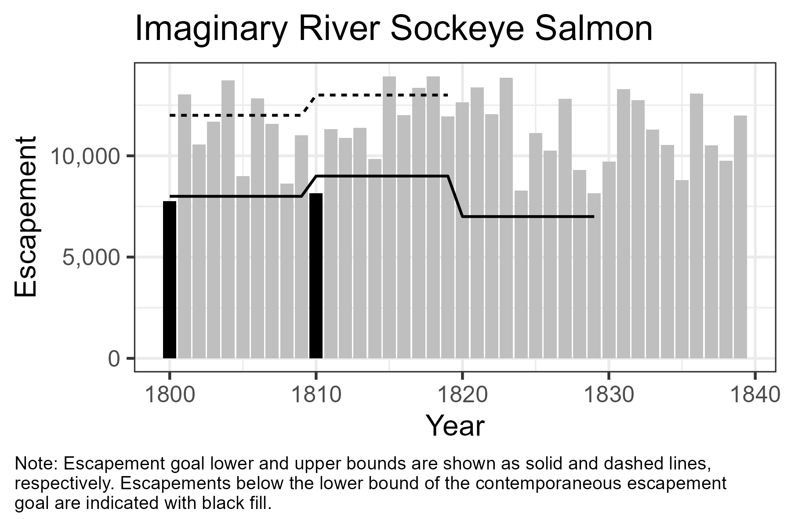
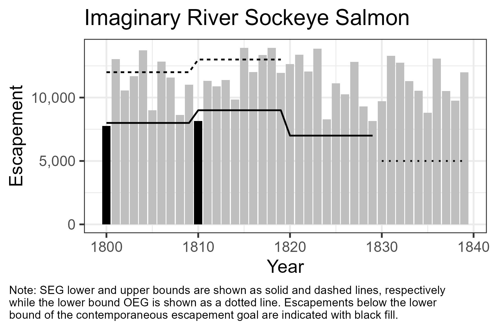
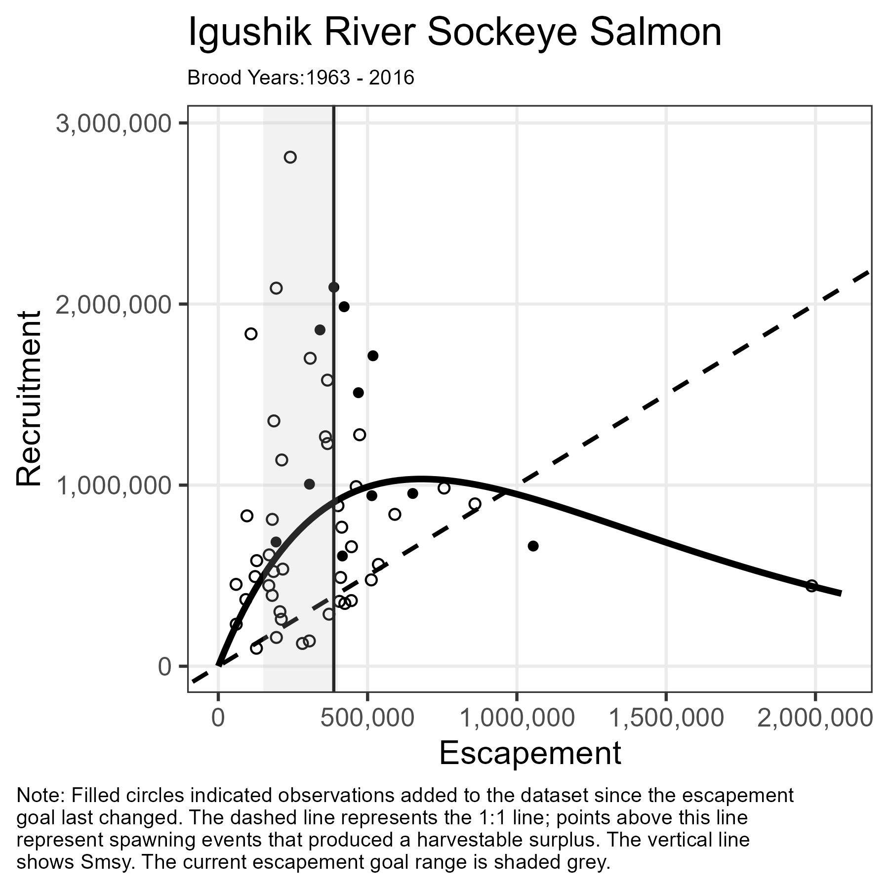
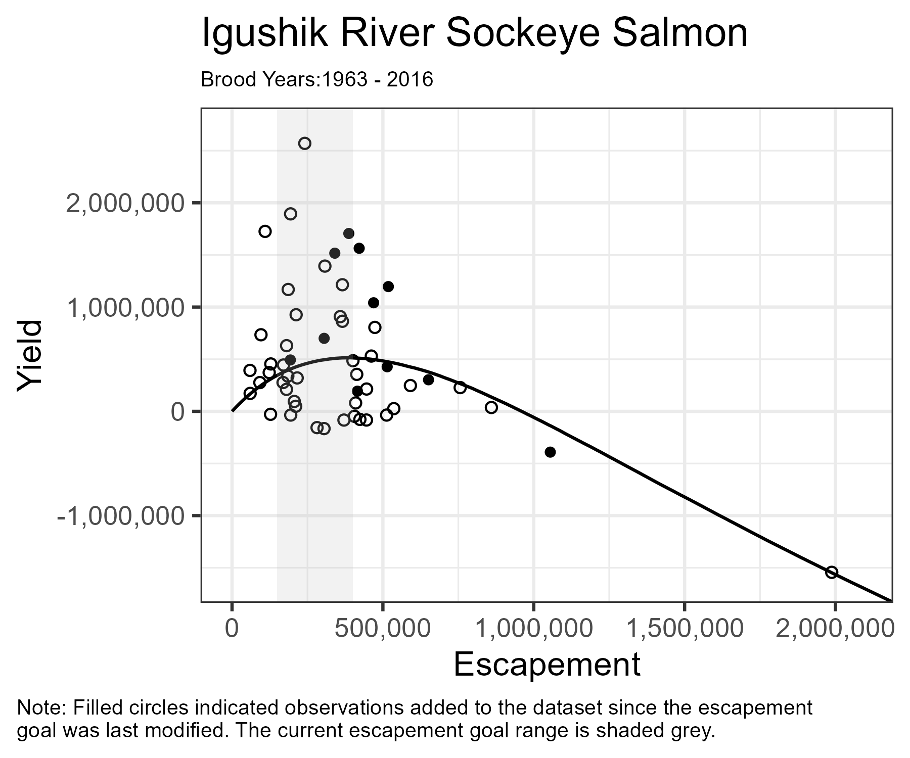
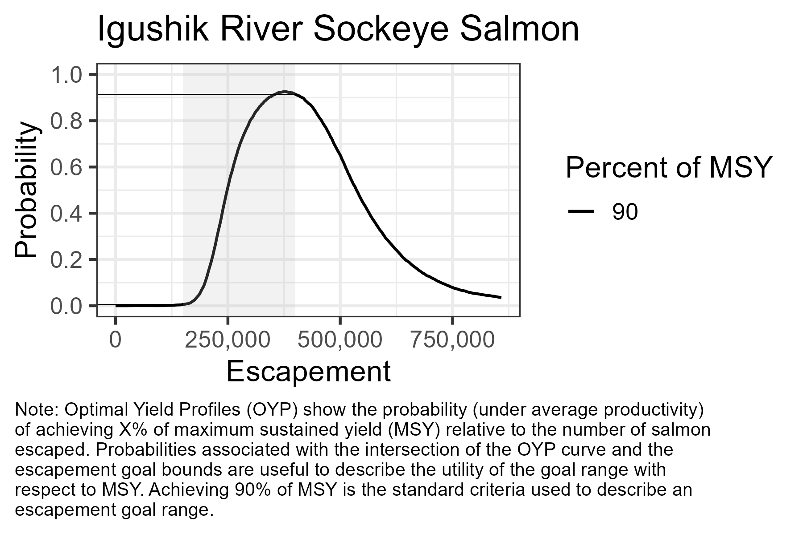
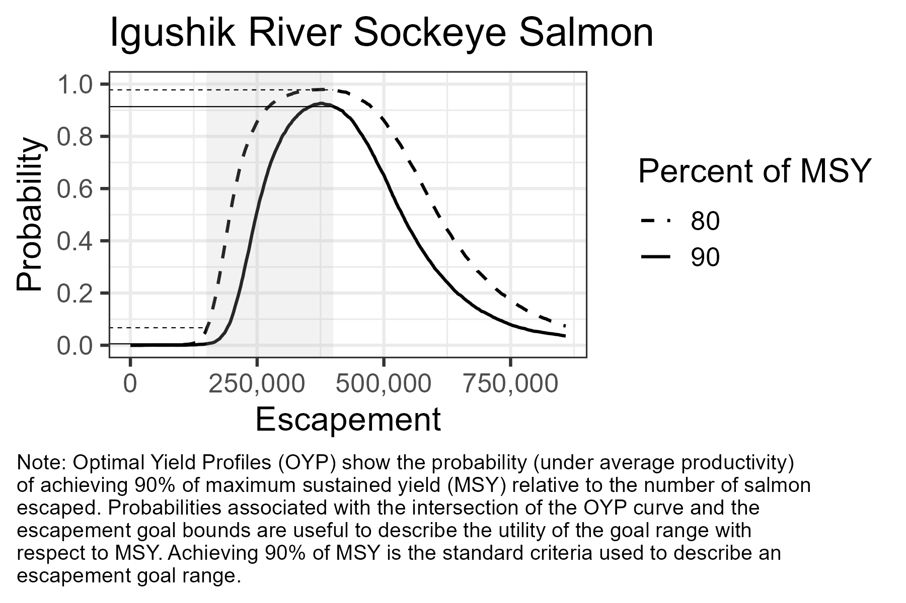

```{r, include = FALSE}
knitr::opts_chunk$set(
  collapse = TRUE,
  comment = "#>"
)
```

```{r, message = FALSE, warning = FALSE}
library(EGprocess)
library(tidyverse)
```

# Preamble

The `EGprocess` package provides R code to support ADF&G staff in production of the figures and tables required during the tri-annual ADF&G escapement goal review process[^1]. Use of this package will allow staff from both ADF&G fisheries divisions, and all regions within both divisions, to present standardized figures and tables to each other, stakeholders and BOF members. By utilizing standardized presentations of similar information reviewers can minimize the time spent orienting themselves to how the information is presented and maximize time spend understanding the information presented.

[^1]: As described in "link to ADF&G report".

Currently, `EGprocess` contains functions designed to produce the figures required during escapement goal review. R functions use the syntax `function(argument1, argument2, argument3, exc.)`. Some arguments control the appearance of the figures they produce while others are used to provide the information being plotted to the function. In `EGprocess`, data argument names all contain the suffix `_dat` (i.e. `S_dat`, `SR_dat`, `post_dat`, `profile_dat` and `goal_dat`). Whenever possible data objects are designed to work seamlessly with both the inputs and outputs either required by or produced by the Pacific Salmon SR Escapement Goal Analysis Shiny Application[^2].

[^2]: [Shiny App](https://hamachan.shinyapps.io/Spawner_Recruit_Bayes/)

For example, the shiny app "Run" type data contain a time series of escapements, run sizes and age compositions of the run. Data in this format satisfy the function argument `S_dat` because they contain columns for calendar year (yr), and escapement (S). Enterprising users could likewise use R to create an .rda file with the same information.  

```{r}
#I like yr, Hamachan likes Year in some places. I think Run data is one of them. Change fuctions to accept either?
head(data_Igushik)
```

Helper functions are provided to modify "Run" type data into the spawner-recruit pairs required to satisfy the function argument `SR_dat` although any .rda file with columns for brood year (byr), escapement (S), and recruits (R) would work.

```{r}
# These function are from Hamanchan's app
# Need to standardize function arguments wrt the rest of the package
# make.brood should make only the SR object
 # Or get Hamachan to make the SR object a standard output (preferred)

# make age composition 
p_Igushik <- make.age(agedata = data_Igushik, 
                      min.age = 3,
                      max.age = 8)
# make brood table
brood_Igushik <- make.brood(data = data_Igushik, 
                            p = p_Igushik)
head(brood_Igushik)
```

The function argument `post_dat` expects random draws from the posterior distributions of `lnalpha`, `beta`, `phi` and `sigma`. Posterior simulations of the spawner-recruit parameters can be retrieve from the shiny app using the *Download MCMC* button.

```{r}
head(post_Igushik)
```

The function argument `profile_dat` is required to build optimal yield profiles (OYP) and expected yield plots. A helper function is provided to create `profile_dat` from `post_dat`.

```{r}
#should this be buried in plot_profile and plot_ey?
#Can download MCMC provide the multiplier?
profile_Igushik <- get_profile(post_dat = post_Igushik, 
                               multiplier = 1e-5)
```

A history of escapement goals for the stock must be built manually. The code snip below shows how to do that for the Igushik River Sockeye salmon stock which has had 3 different escapement goals. Notice that we only have to identify the upper and lower bounds each time the goal changed. In this case the goal was created in 1984 and ranged from 150,000 - 250,000. Since it's creation the goal has been modifed 2 times; once in 2001 when the goal was modified to a range of 150,000-300,000 and again in 2015 when the goal was further modified to a range of 150,000 - 400,000.

```{r}
goal_Igushik <- 
  data.frame(
    yr = c(1984, 2001, 2015),
    lb = c(150000, 150000, 150000),
    ub = c(250000, 300000, 400000)
  )
goal_Igushik
```

# Historical Escapement Plot

EGPIT decided historical escapements should be depicted as a bar plot overlain with the contemporary escapement goal range and color coded to indicate escapements below the lower bound of the contemporary escapement goal. I'll use that plot to first demonstrate some standards that we intend to apply to all figures used throughout the escapement goal review process and then to demonstrate how the figure can be produced using this package and demonstrate some of the capabilities associated with it.

Some commonalities you will find in all figures produced by this package:

-   Use of a plot title. Plots should be titled with stock and species being displayed in the following format: Stock Name Species Name.
-   Use of Arial font.
-   Notes associated with each figure which provide a terse description of the figure's purpose and a textual legend. This approach maximized the percentage of the figure dedicated to displayign the data, ensures the legend travels with the figure, and allows for brief report captions.
-   User retain the ability to customize figures to stock specific situations.

To create this figure you can run the function `plot_S`. A best practice is to create the plot as an object and then export it as a picture for inclusion in the report.

```{r}
Igushik_S <-
  plot_S(S_dat = data_Igushik, 
         title = "Igushik River Sockeye Salmon", 
         goal_dat = goal_Igushik)
ggsave(filename = "../man/figures/Igushik_S.png", #Replace with a path relevant to you.
       plot = Igushik_S, 
       width = 6, 
       height = 4, 
       dpi = 300)
```


<br>

`plot_S` will display both lower bound SEGs and situations where the escapement goal was temporarily rescinded as demonstrated with the fictitious data below. Notice these datasets are not derived from shiny app inputs.

```{r}
Imaginary_S <- 
  plot_S(S_dat = 
    data.frame(
      yr = 1800:1839,
      S = runif(40, 7501, 14000)
    ),
  title = "Imaginary River Sockeye Salmon", 
  goal_dat = 
    data.frame(
      yr = c(1800, 1810, 1820, 1830),
      lb = c(8000, 9000, 7000, NA),
      ub = c(12000, 13000, NA, NA)
      )
  )
ggsave(filename = "../man/figures/Imaginary_S.png", #Replace with a path relevant to you.
       plot = Imaginary_S, 
       width = 6, 
       height = 4, 
       dpi = 300)
```



<br>

The recommendation to standardize figures across divisions and regions does not mean every figure has to be identical. Users are encouraged to use the standardized figures created by `EGprocess` as templates which should be customized to unique situations. Simple modifications may be possible by modifying the standardize plot. For example, if ADF&G rescinded the SEG on Imaginary River beginning in 1830 but the BOF replaced it with an lower bound OEG of 7,500 the previous figure could be modified to describe this situation. Note biometric support exists for staff who are uncomfortable making these changes independently.

```{r}
# Made this to illustrate a point but it does be the question of whether goal type should be an column in the goal_dat.

Imaginary_S_OEG <-
  Imaginary_S +
  geom_line(
    data = 
      data.frame(
        yr = 1830:1839,
        lb = rep(5000, 10)
      ),
    mapping = aes(y = lb),
    linetype = "dotted"
  ) + 
  labs(caption =str_wrap("Note: SEG lower and upper bounds are shown as solid and dashed lines, respectively while the lower bound OEG is shown as a dotted line. Escapements below the lower bound of the contemporaneous escapement goal are indicated with black fill.", width = 85))
ggsave(filename = "../man/figures/Imaginary_S_OEG.png", #Replace with a path relevant to you.
       plot = Imaginary_S_OEG,
       width = 6,
       height = 4,
       dpi = 300)
```



<br>

# Spawner-Recruit Plot

EGPIT decided spawner-recruit (SR) relationships should depicted the SR pairs used to estimate the relationship, the estimated SR relationship, $S_{MSY}$, and the current goal range with color coding to indicate SR pairs added to the dataset since the last time the escapement goal was changed. To create this figure you can run the function `plot_SR`.

```{r}
# make universal so it reads in the goal_dat format and removes the last entry.
# Note Jack told me last modified 2006, Cole said 2001 in goal_range.

Igushik_SR <-
  plot_SR(post_dat = post_Igushik,
          SR_dat = brood_Igushik,
          goal_dat = goal_Igushik,
          title = "Igushik River Sockeye Salmon", 
          multiplier = 1e-5)
ggsave(filename = "../man/figures/Igushik_SR.png", #Replace with a path relevant to you.
       plot = Igushik_SR, 
       width = 6, 
       height = 6, 
       dpi = 300)
```



<br>

# Expected Yield Plot

EGPIT decided expected yield plots should depicted the empirical data used to estimate the relationship, the estimate of expected yield, and the current goal range with color coding to indicate SR pairs added to the dataset since the last time the escapement goal was changed. To create this figure you can run the function `plot_ey`.

```{r}
# make universal so it reads in the goal_dat format and removes the last entry.
# Note Jack told me last modified 2006, Cole said 2001 in goal_range.

Igushik_ey <-
  plot_ey(profile_dat = profile_Igushik,
          SR_dat = brood_Igushik,
          goal_dat = goal_Igushik,
          title = "Igushik River Sockeye Salmon")
ggsave(filename = "../man/figures/Igushik_ey.png", #Replace with a path relevant to you.
       plot = Igushik_ey, 
       width = 6, 
       height = 5, 
       dpi = 300)
```



<br>

# Optimum Yield Profile

EGPIT decided escapement goals intended to target MSY should use a universal standard target yield of greater than 90% of MSY. When producing OYP plots this means a single line, overlain with the current escapement goal is needed to describe the probability of maximizing yield within the escapement goal range. To create this figure you can run the function `plot_profile`.

```{r}
# make universal so it reads in the goal_dat format and removes the last entry.

Igushik_OYP <-
  plot_profile(profile_dat = profile_Igushik, 
            goal_dat = goal_Igushik,
            title = "Igushik River Sockeye Salmon")
ggsave(filename = "../man/figures/Igushik_OYP.png", #Replace with a path relevant to you.
       plot = Igushik_OYP, 
       width = 6, 
       height = 4, 
       dpi = 300)
```



<br>

A standard target of 90% of MSY makes sense for most salmon fisheries in Alaska. Arguably, Igushik River sockeye salmon is not one of them. The first issue is practical, since the lower bound of the escapement goal offers near 0% probability of achieving 90% of MSY the OYP in figure 6 does a poor job of discriminating between changes to the lower bound of the escapement goal. Taken alone, that might be ok. Figure 6 demonstrates the the current goal is sub optimal with respect to a target of 90% of MSY and makes it clear that even lower escapement goal lower bounds would be even less optimal. However, Bristol Bay stakeholders have expressed a preference for sub optimal yield to ensure that fisheries open regularly and the fishery harvest do not exceed processor capacity in the area[^3]. In situations like this, where staff and stakeholders can clearly describe a need and/or preference to target sub optimal yield, profile plots should be modified to describe escapement goal performance relative to both optimal and suboptimal yield. This can be achieved by creating a new profile and plot using the function `get_profile` ans `plot_profile` respectively. 

[^3]: https://www.bbsri.org/_files/ugd/bc10d6_adeb1b9e83fa411dba02044cc76565c9.pdf

```{r}
# make universal so it reads in the goal_dat format and removes the last entry.
profile_Igushik_80 <- 
  get_profile(post_dat = post_Igushik, 
              multiplier = 1e-5, 
              OYP_pct = 80) # creates a second profile that includes both 90% and 80% of MSY targets.

Igushik_OYP_80 <-
  plot_profile(profile_dat = profile_Igushik_80, 
               goal_dat = goal_Igushik,
               title = "Igushik River Sockeye Salmon")
ggsave(filename = "../man/figures/Igushik_OYP_80.png", #Replace with a path relevant to you.
       plot = Igushik_OYP_80, 
       width = 6, 
       height = 4, 
       dpi = 300)
```



<br>
