```{r, include = FALSE}
knitr::opts_chunk$set(
  collapse = TRUE,
  comment = "#>"
)
```

```{r, message = FALSE, warning = FALSE}
library(EGprocess)
library(tidyverse)
```

# Preamble

The `EGprocess` package provides R code to support ADF&G staff in production of the figures and tables required during the tri-annual ADF&G escapement goal review process[^1]. Use of this package will allow staff from both ADF&G fisheries divisions, and all regions within both divisions, to present standardized figures and tables during the escapement goal review process internally, to stakeholders and to BOF members. By utilizing standardized presentations of similar information reviewers can minimize the time spent orienting themselves to how the information is presented and maximize time spend understanding the information presented.

[^1]: As described in "link to ADF&G report".

Every salmon escapement goal in the State of Alaska is reviewed triennially synchronous with the BOF meeting cycle for each geographic area or region. The initial decision facing department staff is whether the escapement goal analysis for each stock in requires an update during the current BOF cycle. `EGprocess` is intended to standardize the presentation of updated analyses. 

This vignette will demonstrate use of `EGprocess` during the escapement goal review process using the Igushik River Sockeye salmon stock as an example. The BOF last considered Bristol Bay salmon stocks during a meeting on January 13-18, 2026. Prior to this meeting, ADF&G staff decided to updated the Igushik River Sockeye salmon analysis and the data which supported the updated analysis and the results from the updated analysis is loaded into `EGprocess` as example data.  

# Required data

`EGprocess` contains functions designed to produce the figures and tables required during escapement goal review. R functions use the syntax `function(argument1, argument2, argument3, exc.)`. In all `EGprocess` functions the first several arguments reference the data being plotted and can be identified by the suffix `_data`. Data objects are designed to work seamlessly with inputs and outputs to the Pacific Salmon SR Escapement Goal Analysis Shiny Application[^2] but can also be easily produced in R if the spawner-recruit analysis is done outside of the shiny application. 

[^2]: [Shiny App](https://hamachan.shinyapps.io/Spawner_Recruit_Bayes/)

## brood_data

A brood table is the basic data object required to run a spawner-recruit analysis. In the shiny app the brood table is created internally from the "Run" type data provided to the shiny app. When the Igushik River Sockeye salmon analysis was updated prior to the 2026 BOF meeting the input data contained escapement (`S`), run (harvest + escapement, `N`) and age composition information (`A3`-`A8`) from the 1996 - 2023 seasons.

```{r}
#Showing only the first and last 5 rows to save space.
head(data_Igushik)
tail(data_Igushik)
```

`EGprocess` contains helper functions to create the brood table from "Run" type data. The function `make_age` creates the age composition used in the spawner-recruit analysis and is a required input to build the brood table. The function `make_brood` creates the brood table itself. *(Note to EGPIT: Use of these helper functions will likely go away. A better approach would be for the shiny app to output the exact information needed to produce these plots. Hamachan, Justin and i are working together to make that happen.)* Notice that the results is 'jagged' and includes escapements (`S`), recruits (`R`) and return-by-age (`b.Age#`) which were not observed. For example, the Igushik River Sockeye salmon analysis update conducted prior to the 2026 BOF meeting utilized escapement information through 2023 but only had recruitment through 2015 because 8 year old fish from the 2015 escapement were not observed until 2023. 

```{r}
# These don't do what I thought they did. Brood table built off data not p. It works but not if we attempted to pool extreme ages.
# It would be preferable to have the shiny app output the required information rather than attempting to recreate them externally. Brood table, posterior, multiplier, max_age are needed. 

# make age composition
p_Igushik <- make_age(age_data = data_Igushik,
                      min_age = 3,
                      max_age = 7)

# make brood table
brood_Igushik <- make_brood(data = data_Igushik,
                            p = p_Igushik)

# Showing only the first and last 12 rows to save space.
head(brood_Igushik, n = 12)
tail(brood_Igushik, n = 12)
```

## goal_data

The data file `goal_Igushik` contains the history of escapement goals for the Igushik River Sockeye salmon. The functions in `EGprocess` expect the `goal_data` argument to be a dataframe that contains a new row for each year where the escapement goal changed. For Igushik River Sockeye salmon the goal was created in 1984 and ranged from 150,000 to 250,000 fish. In 2001, the analysis was updated resulting in a new escapement goal finding of 150,000 to 300,000 fish. In 2015, the analysis was updated again resulting in a new escapement goal finding of 150,000 to 400,000 fish. 

```{r}
goal_Igushik
```

## posterior_data

The function argument `posterior_data` expects random draws from the posterior distributions of `lnalpha`, `beta`, `phi` and `sigma` and can be retrieve from the shiny app using the *Download MCMC* button. Colloquially, one can think of the rows in `posterior_data` representing possible values of `lnalpha`, `beta`, `phi` and `sigma` (and in combination possible mean and median spawner-recruit or expected yield relationships) that are supported by the empirical data used in the analysis. Two examples of `posterior data` are available in `EGprocess`. The file `post_Igushik_byr63_15` represents posterior draws from the analysis update that occurred prior to the 2026 Bristol Bay BOF meeting. Using descriptive names for `posterior_data`, referencing the brood years included in the analysis and/or model specifications used, is a best practice when saving these objects.   

```{r}
head(post_Igushik_byr63_15)
```

Recall that the previous escapement goal update that resulted in a new escapement goal finding occurred in 2015. Spawning escapements and the subsequent recruitment from the 1963 - 2005 brood years were available to inform that finding. `EGprocess` also contains the file `post_Igushik_byr63_05` representing posterior draws from the analysis which informed the 2015 finding[^3].

[^3]: Staff knowledgeable about the history of Bristol Bay sockeye salmon escapement goals will recognize this statement is not strictly true. Instead the file, `post_Igushik_byr63_05` contains model output using only the 1963 - 2005 brood years because we were unable to locate the actual posterior produced in 2015. This is sufficient to demonstrate use of the `EGprocess` package and not intended to provide complete historic fidelity.   

```{r}
head(post_Igushik_byr63_05)
```

In the State of Alaska most salmon stocks have existing escapement goals and those escapement goals bounds represent the result of extensive negotiations that account for not only th information about how to maximize sustained yield that was provided by the analysis but also concerns about stock status that are poorly reflected in the analysis and concerns from stakeholders and management staff about how to most effectively persecute the fishery. For these reasons, it is often most helpful to consider how the updated escapement goal analysis changes our interpretation of the existing goal rather than using the updated analysis to develop an new escapement goal finding naively. `EGprocess` can help make this comparison if both sets of posterior data are provided to the functions as a list with the posteriors named and provided in chronological order.

```{r}
post_Igushik_list <- 
  list('byr: 1963-2005' = post_Igushik_byr63_05,
       'byr: 1963-2015' = post_Igushik_byr63_15
  )
```

### profile_data

Some `EGprocess` functions utilize the function argument `profile_data` which is a derivative of the `posterior data` files described above and are required to build optimal yield profiles (OYP) and expected yield plots. A helper function is provided to create `profile_data` from `posterior_data`. 

```{r}
# For a single posterior
profile_Igushik_byr63_15 <- 
  get_profile(posterior_data = post_Igushik_byr63_15,
              multiplier = 1e-5)

#When posteriors are combined into a list
profile_Igushik_list <- 
  lapply(post_Igushik_list, 
         FUN = get_profile, 
         multiplier = 1e-5)
```

# EGprocess output

The simplest way to retrieve the output from `EGprocess` is to run the function `output_SR` which is a wrapper that calls all of the outputs within the package that are relevant when a spawner-recruit analysis has been updated during the escapement goal review process. Some commonalities you will find in all figures produced by this package:

-   Use of a plot title. Plots should be titled with stock and species being displayed in the following format: Stock Name Species Name.
-   Use of Arial font.
-   Notes associated with each figure which provide a terse description of the figure's purpose and a textual legend. This approach maximizes the percentage of the figure dedicated to displaying the data, ensures the legend travels with the figure, and allows for brief report captions.
-   Users retain the ability to customize figures to stock specific situations.
```{r}
output_Igushik <-
  output_SR(posterior_data = post_Igushik_list, 
            brood_data = brood_Igushik, 
            goal_data = goal_Igushik, 
            title = "Igushik River Sockeye Salmon", 
            multiplier = 1e-5)

#Save the historical escapement figure as a png file
ggsave(filename = "../man/figures/Igushik_escapement.png", #Replace with a path relevant to you.
       plot = output_Igushik[[1]],
       width = 6,
       height = 4,
       dpi = 300)

#Save the Spawner-Recruit figure as a png file
ggsave(filename = "../man/figures/Igushik_spawner_recruit.png", #Replace with a path relevant to you.
       plot = output_Igushik[[2]],
       width = 6,
       height = 6,
       dpi = 300)

#Save the expected yield figure as a png file
ggsave(filename = "../man/figures/Igushik_ey.png", #Replace with a path relevant to you.
       plot = output_Igushik[[3]],
       width = 6,
       height = 5,
       dpi = 300)

#Save the OYP figure as a png file
ggsave(filename = "../man/figures/Igushik_profile.png", #Replace with a path relevant to you.
       plot = output_Igushik[[4]],
       width = 6,
       height = 4,
       dpi = 300)
```

EGPIT decided historical escapements should be depicted as a bar plot overlain with the contemporary escapement goal range and color coded to indicate escapements below the lower bound of the contemporary escapement goal. *(Note to EGPIT: It might make more sense to color the escapements added to the analysis since the last goal change in Figure 1. This would be more consistent with the other figures and escapements below the lb are self evident to the reader.)*

<br>

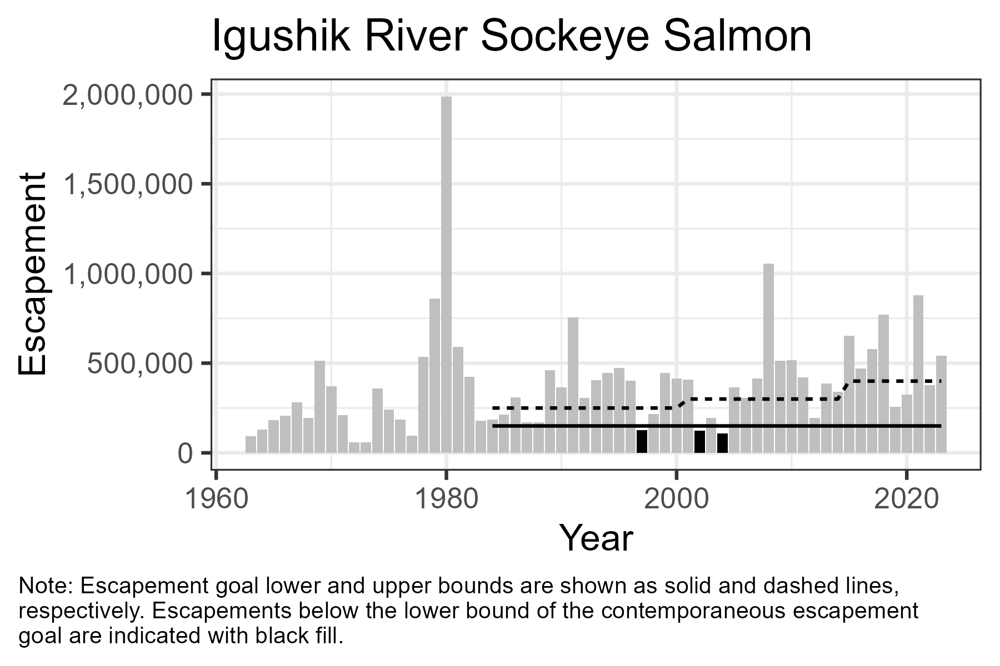

<br>

EGPIT decided spawner-recruit (SR) relationships should depicted the SR pairs used to estimate the relationship, the estimated SR relationship, $S_{MSY}$, and the current goal range with color coding to indicate SR pairs added to the dataset since the last time the escapement goal was changed.

<br>

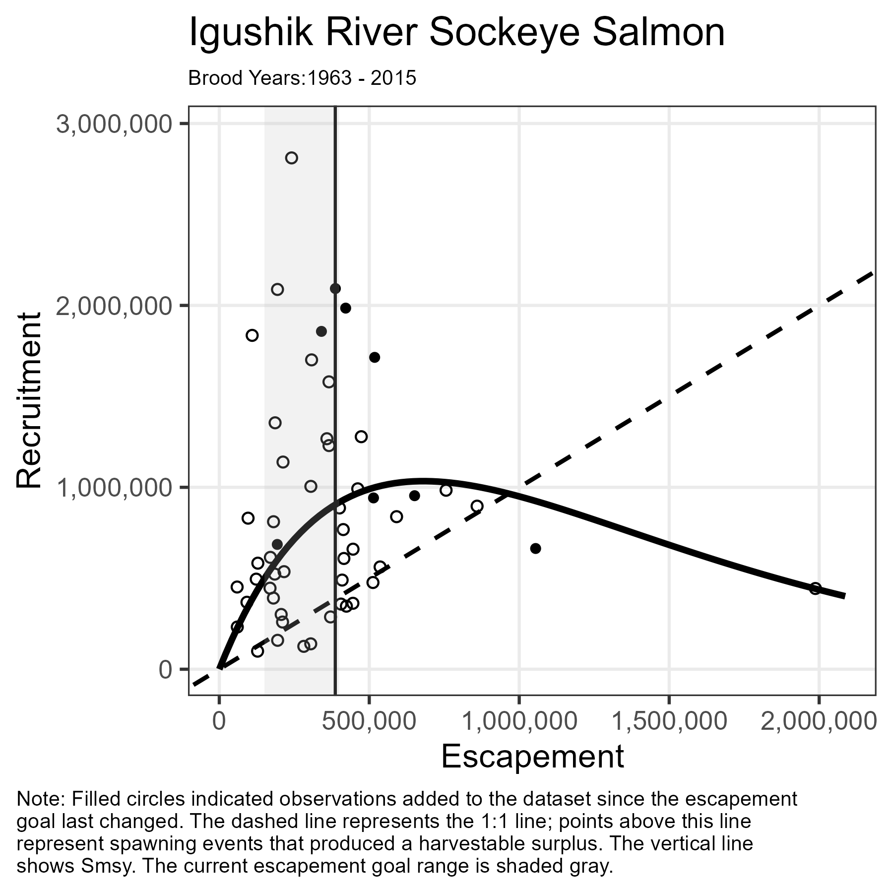

<br>

EGPIT decided expected yield plots should depicted the empirical data used to estimate the relationship, the estimate of expected yield, and the current goal range with color coding to indicate SR pairs added to the dataset since the last time the escapement goal was changed. 

<br>


<br>

EGPIT decided escapement goals intended to target MSY should use a universal standard target yield of greater than 90% of MSY. When producing OYP plots this means a single line, overlain with the current escapement goal is needed to describe the probability of maximizing yield within the escapement goal range. By displaying the OYP generated from both the updated analysis and the last analysis update which resulted in a escapement goal change ADF&G staff can easily compare how the empirical data added since the last escapement goal change has impacted the relationship between MSY and the goal. In this case, 10 additional brood years resulted in a slight rightward shift of the OYP and minimal changes to the probability of achieving at least 90% of MSY at both the upper and lower bound of the existing goal. Thus, this presentation supports the escapement goal committees recommendation of no change to the escapement goal. 

<br>

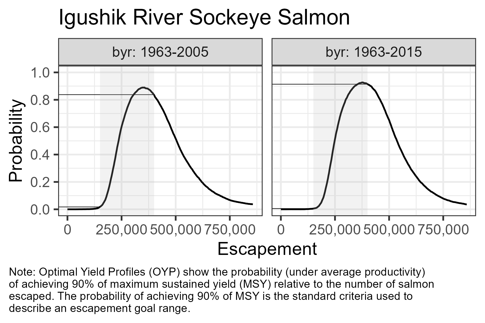

<br>


## Figure Modifications
### New Escapement Goal Finding

During the escapement goal review process for Igushik River Sockeye salmon the escapement goal review committee elected not to change the escapement goal. Imagine the committee had disregarded the stability of the relations hip between the escapement goal bounds and the OYP probabilities and decided the goal was too aggressive relative to a target of 90% of MSY. This imaginary committee may have decided increases to both the lower and upper bounds of the existing escapement goal were appropriate.   universe the committee may have determined a new escapement goal finding was appropriate. This decision could have been communicated using `EGprocess` outputs by modifying the `goal_dat` file. 

```{r}
# It's likely better to have the new year be numeric. Make sure the functions would handle that well provided the new finding year > max(brood_data$yr)
goal_imaginary <- 
  goal_Igushik %>%
  mutate(yr = as.character(yr)) %>%
  bind_rows(
    data.frame(yr = "new",
               lb = 175000,
               ub = 500000)
  )
goal_imaginary
```

In what follows we will also change the figure titles to make clear that this is an imaginary example.
```{r}
# Should name the elements in the output list
output_imaginary <-
  output_SR(posterior_data = post_Igushik_list, 
            brood_data = brood_Igushik, 
            goal_data = goal_imaginary, 
            title = "Imaginary River Sockeye Salmon", 
            multiplier = 1e-5)

#Save the historical escapement figure as a png file
ggsave(filename = "../man/figures/imaginary_escapement.png", #Replace with a path relevant to you.
       plot = output_imaginary[[1]],
       width = 6,
       height = 4,
       dpi = 300)

#Save the Spawner-Recruit figure as a png file
ggsave(filename = "../man/figures/imaginary_spawner_recruit.png", #Replace with a path relevant to you.
       plot = output_imaginary[[2]],
       width = 6,
       height = 6,
       dpi = 300)

#Save the OYP figure as a png file
ggsave(filename = "../man/figures/imaginary_profile.png", #Replace with a path relevant to you.
       plot = output_imaginary[[4]],
       width = 6,
       height = 4,
       dpi = 300)
```

The new escapement goal finding is shown as a change to the escapement goal range overlain on yet to be observed escapements.

<br>

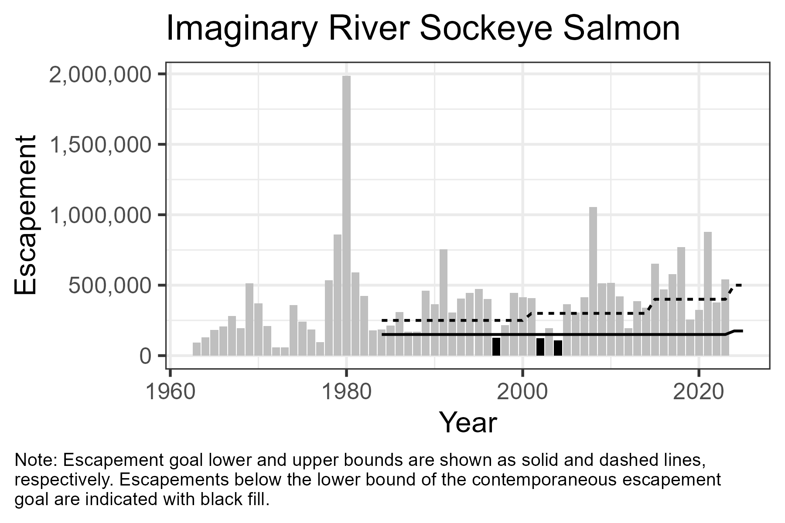

<br>

The new escapement goal finding is overlain on both the spawner-recruit and expected yield (not shown) figures.

<br>

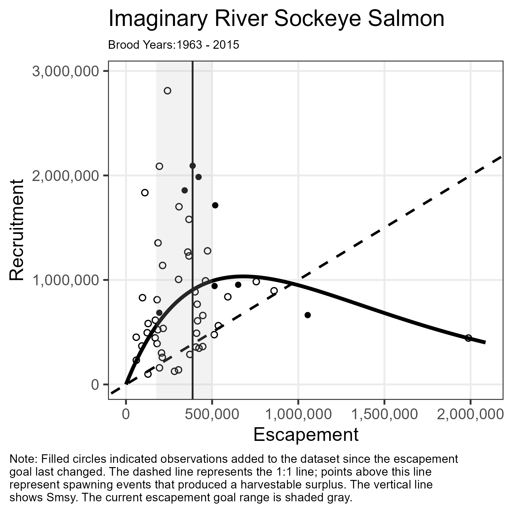

<br>

The new escapement goal finding is overlain on the optimal yield profile for the updated analysis while the current escapement goal range is overlain on the optimal yield profile concurrent with the last escapement goal change. This configuration allows staff to compare the degree of similarity between the new and past escapement goal findings with respect to maximizing MSY. In this case, the new escapement goal finding offers improved symmetry between the upper on lower escapement goal bounds and roughly probability of achieving at least 90% of MSY at the lower bound but decreased probability of achieving at least 90% of MSY at the upper bound. 

<br>

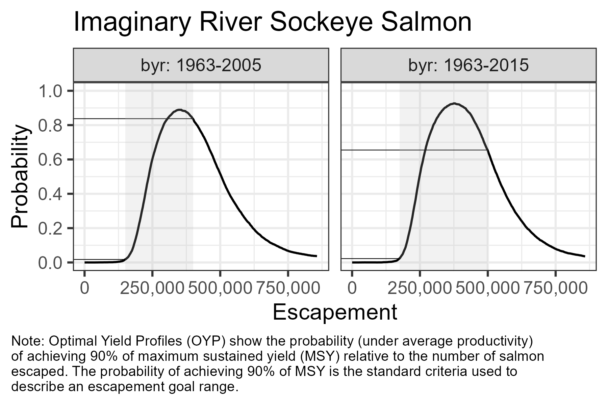

<br>

### First Escapement Goal Finding

First time  escapement goals can be accommodated by creating a `goal_dat` file that reflects that status. 

```{r}
# It's likely better to have the new year be numeric. Make sure the functions would handle that well provided the new finding year > max(brood_data$yr)
goal_nonexistant <- 
  data.frame(yr = "new",
             lb = 175000,
             ub = 500000
  )
goal_nonexistant
```

In what follows we will also change the figure titles to make clear this fishery is nonexistent. Notice that `profile_data` is provided a single profile file since there is no prior analysis for comparison.
```{r}
output_nonexistant <-
  output_SR(posterior_data = post_Igushik_byr63_15, 
            brood_data = brood_Igushik, 
            goal_data =goal_nonexistant, 
            title = "Nonexistant River Sockeye Salmon", 
            multiplier = 1e-5)

#Save the historical escapement figure as a png file
ggsave(filename = "../man/figures/nonexistant_escapement.png", #Replace with a path relevant to you.
       plot = output_nonexistant[[1]],
       width = 6,
       height = 4,
       dpi = 300)

#Save the Spawner-Recruit figure as a png file
ggsave(filename = "../man/figures/nonexistant_spawner_recruit.png", #Replace with a path relevant to you.
       plot = output_nonexistant[[2]],
       width = 6,
       height = 6,
       dpi = 300)

#Save the OYP figure as a png file
ggsave(filename = "../man/figures/nonexistant_profile.png", #Replace with a path relevant to you.
       plot = output_nonexistant[[4]],
       width = 6,
       height = 4,
       dpi = 300)
```

A first time escapement goal finding is overlain on yet to be observed escapements of the historical escapement plot.

<br>

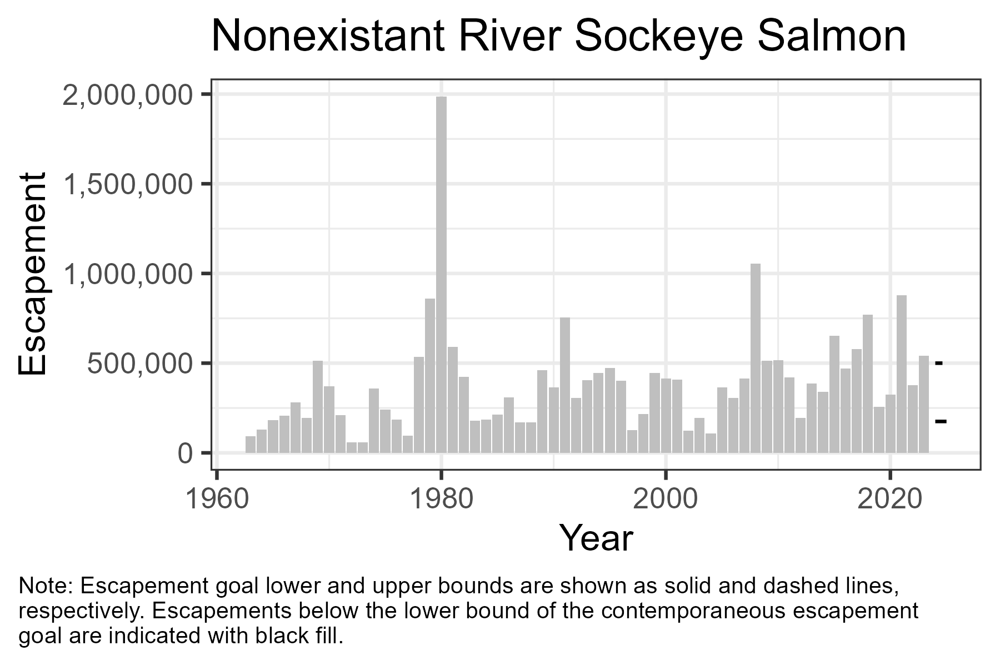

<br>

First time escapement goal findings are overlain on both the spawner-recruit and expected yield (not shown) figures and all points are colored similarly.

<br>

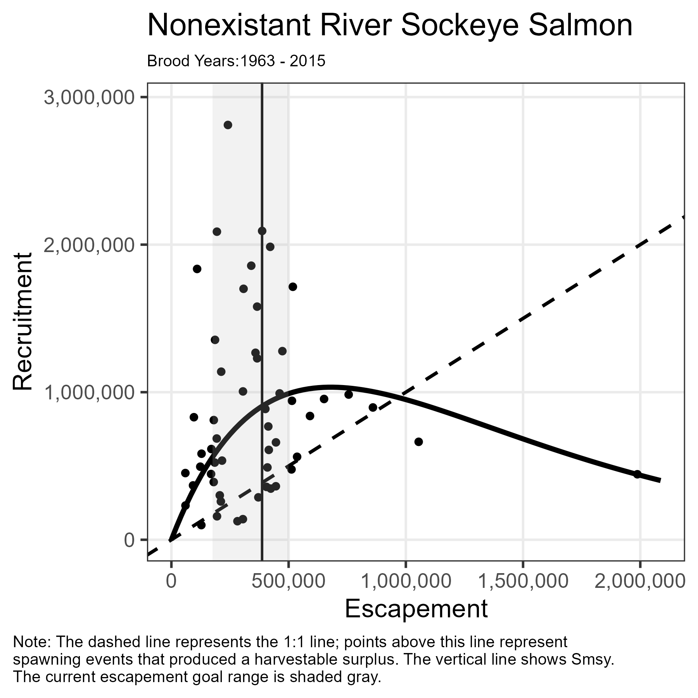

<br>

First time escapement goal findings are overlain on the optimal yield profile. Since a single profile was provided to `profile_data` a single OYP is displayed.

<br>

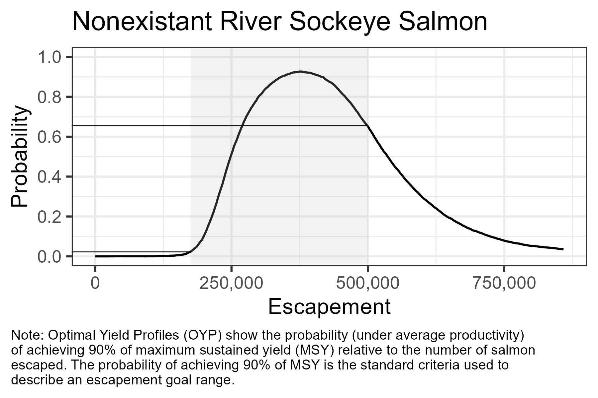

<br>

### Lower Bound SEG / Rescinded Goals

The `goal_dat` file can handle lower bound SEGs and situations where the escapement goal was temporarily rescinded as demonstrated with the fictitious data below. We will also use this example to demonstrate the use of datasets that were not derived from shiny app inputs, use of a single plotting function, and modifying the default output to fit unique situations.

```{r}
fictitious_escapement <-
  plot_escapement(
    brood_data =
      data.frame(
        yr = 1800:1839,
        S = runif(40, 7501, 14000)
      ),
  title = "Fictitious River Sockeye Salmon",
  goal_data =
    data.frame(
      yr = c(1800, 1810, 1820, 1830),
      lb = c(8000, 9000, 7000, NA),
      ub = c(12000, 13000, NA, NA)
      )
  )
ggsave(filename = "../man/figures/fictitious_escapement.png", #Replace with a path relevant to you.
       plot = fictitious_escapement,
       width = 6,
       height = 4,
       dpi = 300)
```

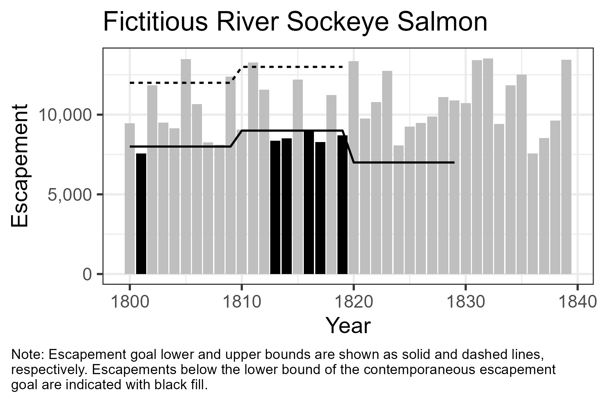

<br>

The recommendation to standardize figures across divisions and regions does not mean every figure has to be identical. Users are encouraged to use the standardized figures created by `EGprocess` as templates which can be customized to unique situations. In these situations user can create an new graphic from scratch while making similar design choices to the standardized figures. An easy way to do that is to mimic the ggplot theme used by the standardize figures. 

Alternatively, simple modifications may be possible directly on the standardize plot. For example, if ADF&G rescinded the SEG on Fictitious River beginning in 1830 but the BOF replaced it with an lower bound OEG of 7,500 the previous figure could be modified to describe this situation. Note biometric support exists for staff who are uncomfortable making these changes independently.

```{r}
# Made this to illustrate a point but it does be the question of whether goal type should be an column in the goal_dat.

fictitious_escapement_OEG <-
  fictitious_escapement +
  geom_line(
    data =
      data.frame(
        yr = 1830:1839,
        lb = rep(5000, 10)
      ),
    mapping = aes(y = lb),
    linetype = "dotted"
  ) +
  labs(caption =str_wrap("Note: SEG lower and upper bounds are shown as solid and dashed lines, respectively while the lower bound OEG is shown as a dotted line. Escapements below the lower bound of the contemporaneous escapement goal are indicated with black fill.", width = 85))
ggsave(filename = "../man/figures/fictitious_escapement_OEG.png", #Replace with a path relevant to you.
       plot = fictitious_escapement_OEG,
       width = 6,
       height = 4,
       dpi = 300)
```

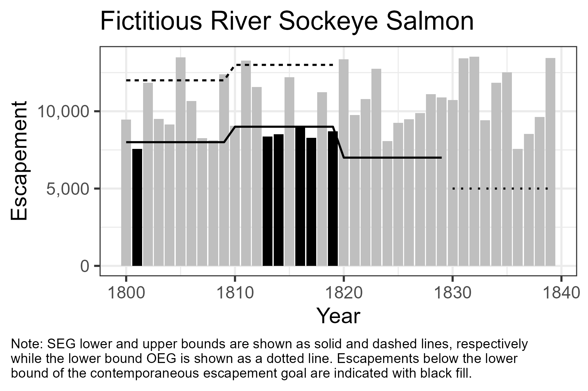

<br>

### Escapement Goal evaluation against a lower MSY target

EGPIT decided escapement goals intended to target MSY should use a universal standard target yield of greater than 90% of MSY. A standard target of 90% of MSY makes sense for most salmon fisheries in Alaska. Arguably, Igushik River sockeye salmon is not one of them. The first issue is practical, since the lower bound of the escapement goal offers near 0% probability of achieving 90% of MSY the OYP in Figure 4 does a poor job of discriminating between potential changes to the lower bound of the escapement goal. Taken alone, that might be ok. Figure 4 demonstrates the the current goal is sub optimal with respect to a target of 90% of MSY and makes it clear that reducing the escapement goal lower bound further would be even less optimal. However, Bristol Bay stakeholders have expressed a preference for sub optimal yield because they prefer fisheries that open regularly and because the fishery harvests can easily exceed processor capacity even with sub optimal yield[^4]. In situations like this, where staff and stakeholders can clearly describe a need and/or preference to target sub optimal yield, profile plots can be modified to evaluate escapement goals relative to both optimal and sub optimal yield. This can be achieved by specifying the sub optimal yield level to the function `get_profile`. *(Note to EGPIT: We should decide if this functionality is needed.)*

[^4]: https://www.bbsri.org/_files/ugd/bc10d6_adeb1b9e83fa411dba02044cc76565c9.pdf

```{r}
profile_Igushik_80 <-
  lapply(post_Igushik_list,
         get_profile,
         multiplier = 1e-5,
         MSY_pct = 80) # creates a second profile that includes 80% MSY targets.

Igushik_profile_80 <-
  plot_profile_facet(profile_dat = profile_Igushik_80,
                     goal_dat = goal_Igushik,
                     title = "Igushik River Sockeye Salmon")
ggsave(filename = "../man/figures/Igushik_profile_80.png", #Replace with a path relevant to you.
       plot = Igushik_profile_80,
       width = 6,
       height = 4,
       dpi = 300)
```

<br>

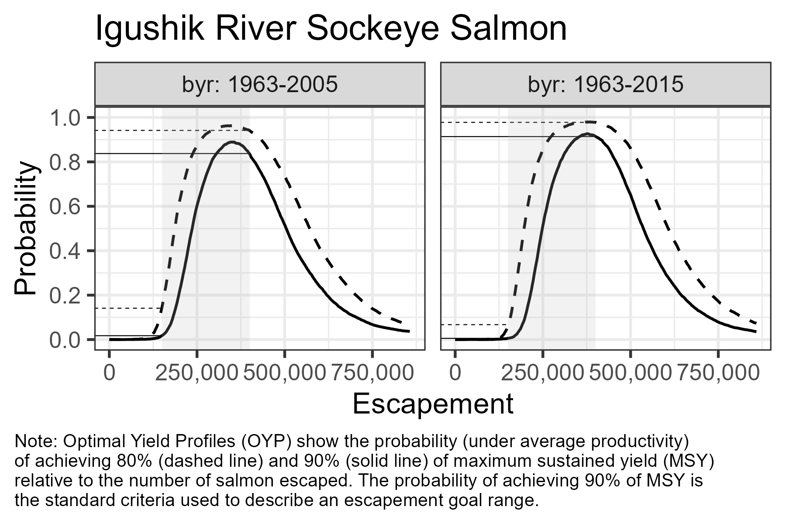
